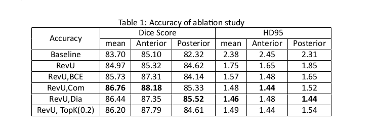
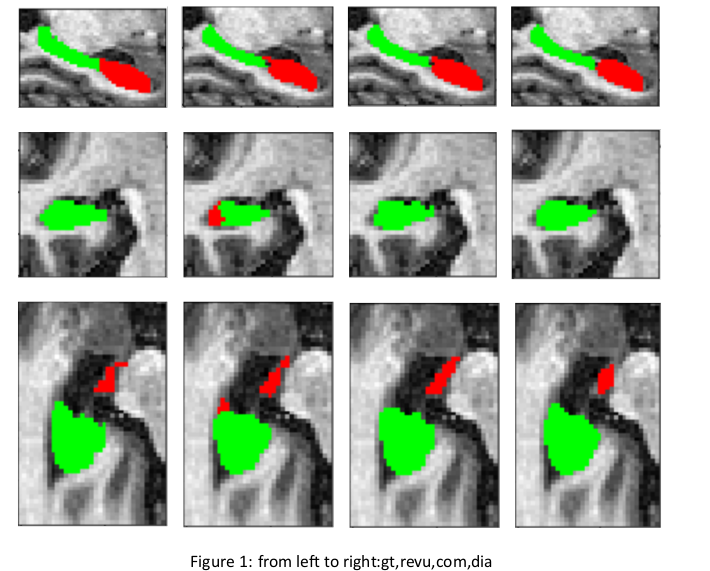

# Reversible U-net for Medical Image Segmentation
+ This repos is revised based on https://github.com/RobinBruegger/PartiallyReversibleUnet
+ The course project require us to read on a paper and then revise and modify based on original project
+ Due to the time and compuational resource limit, I deprecated the original codes with following changes:
  + Transfer from brain tumor segmentation to hippocampus segmentation
  + revise pure dice loss to BCE loss and comibination of dice loss and BCE loss to compare impact of different loss
  + add dialted convolution
  + I also try to improve the result with some machine learning tricks like top-k loss
  + I revise the original baseline model for more fair comparision(similar number of network parameters)
+ This repo is a implemented-from-scratch version and will move to a mutli-task topic in future
+ Results from report
  + Numerical Results\
    
  + Visual Results(in slices)\
    
## Code Structure for Deep Learning
  + Data
    + process_hdf5 save as hdf5
    + process_json(tbd) 
      + json output with images path and label path
  + Models
    + utils - necessary function
      + maybe move evaluation metric here?
    + network
      + no-new-net with different elemental blocks 
    + loss
    + backbone network
      + network blocks
  + dataProcessing
    + dataloader for train and test
  + Utils
    + logger
    + evaluation/metric
  + visualization - jupyter notebook
  + Trainer - APIs
    + save/load weights
    + lr scheduler
    + optimizer   
  + train
  + test
  + evaluation - evaluate predicted result
  + config - configurate parpameters
# Next Step
  + implement revtorch blocks by myself to try to improve
  + move to a 
+ Ref and cite:
  @article{PartiallyRevUnet2019Bruegger,\
          author={Br{\"u}gger, Robin and Baumgartner, Christian F.
          and Konukoglu, Ender},\
          title={A Partially Reversible U-Net for Memory-Efficient Volumetric Image Segmentation},\
          journal={arXiv:1906.06148},\
          year={2019},}